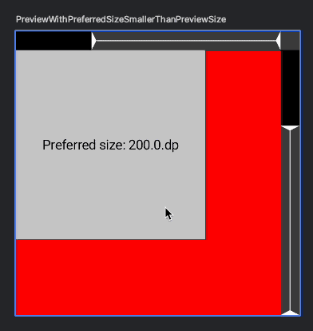
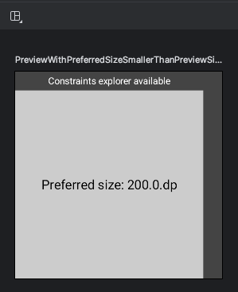
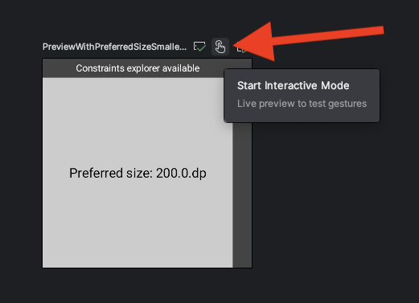
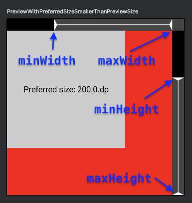

# constraints-explorer [](https://central.sonatype.com/artifact/com.zachklipp/constraints-explorer)

A lightweight tool to help understand and debug how Compose's layout constraints affect your
composables. It's intended to use in previews and lets you adjust the constraints interactively:



To learn more about Compose's layout system and the role of constraints, see the [documentation on
Developer Android](https://developer.android.com/develop/ui/compose/layouts/basics).

## Usage

To use it, first add the dependency:

```kotlin
implementation("com.zachklipp:constraints-explorer:{version}")
```

_Note that for now, this is an Android-only library, since it's intended to be used with Android
Studio's preview feature. However, I'm open to making it Compose Multiplatform eventually._

Then, assuming your project has some `@Preview`s, wrap the contents of a preview with the
`ConstraintsExplorer` composable:

```kotlin
@Preview
@Composable
private fun YourComposablePreview() {
  ConstraintsExplorer {
    // Your preview code goes here.
    YourComposable()
  }
}
```

Refresh the preview, and you should see your composable with a gray bar on the top and the right
of the preview frame, and a label that says “Constraint explorer available”.



To get the interactive preview, simply enter the preview's “Interactive mode” by clicking on this
button:



The gray bars around your preview will get some triangles. These represent the minimum and maximum
constraints that get passed to your composable's layout. You can drag these triangles around to
adjust the constraints and see your composable react in real-time.



In interactive mode, the preview will expand to fill the maximum constraints of the preview area.
The constraints explorer does not draw anything behind your component. In the above screenshot, the
preview is configured with a red background to highlight where the actual component bounds are.

By default, `ConstraintsExplorer` won't do anything when not running in a preview. This probably
won't matter if you only use this composable in your `@Preview` functions, but it also means that
if you're using your previews for tests (e.g. snapshot tests with Paparazzi), it won't show up in
those tests. You can override this behavior by passing the `enabled` flag to `ConstraintsExplorer`.

## Motivation

This tool was originally written as a companion to an
[article about centering](https://blog.zachklipp.com/centering-in-compose/).